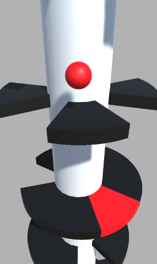

# Ball Jump

Ball Jump is an entry-level Hyper Casual game developed in Unity3D. The game challenges players to guide a ball down a twistable tower filled with empty spaces. Players must use their mouse to rotate the tower, allowing the ball to pass through gaps while avoiding colliding with red platforms. Be careful, as colliding with red platforms results in a game over!

## Table of Contents

- [Overview](#overview)
- [Features](#features)
- [How to Play](#how-to-play)
- [Credits](#credits)

## Overview

Ball Jump provides a simple yet addictive gameplay experience suitable for players of all ages. The intuitive controls and a challenging level make it a perfect choice for quick gaming sessions.

## Features

- Intuitive mouse controls for rotating the tower.
- Empty spaces to navigate through and red platforms to avoid.
- Engaging Hyper Casual gaming experience.

## How to Play

- Rotate the Tower: Hold down the left mouse button and move the mouse to rotate the tower.
- Navigate the Ball: Guide the ball through the empty spaces while avoiding red platforms.
- Game Over: Colliding with red platforms results in a game over. Try to finish the level by descending to the end of the level.

## Credits

Special thanks to Fahir from Awesome Tuts for this project.
